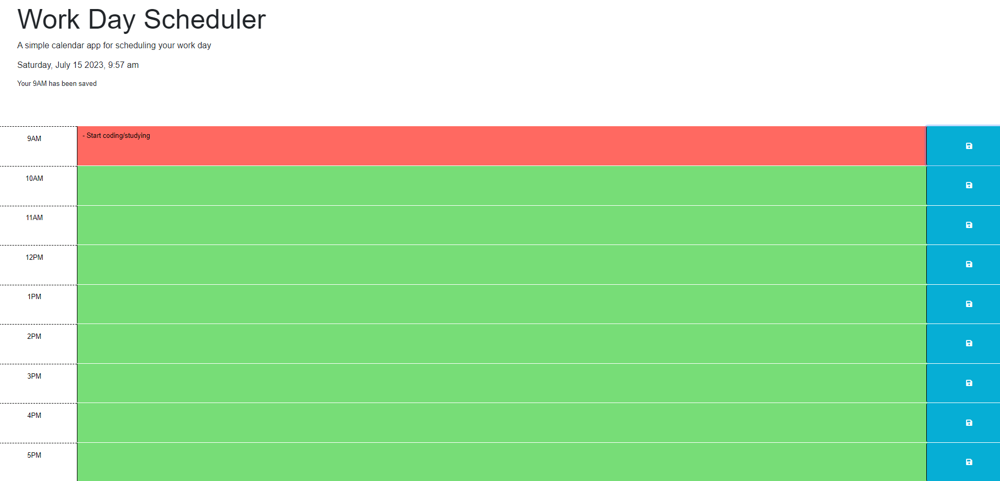

# Work Day Scheduler 

# Description
This is a work day schedule for those who work 9AM to 5PM who likes to stay organized. If the time is on present time the schedule will light up red advising you that this is the current time and the tasks to do at that time. If the schedule is green then that means time has not come yet. Once the time has past, a grey background will pop up advising that the task has been done. With this daily schedule, you will surely know that you will stay on task. 

Link: 

# Installation
N/A

# Usage
The user will start their day with the 9AM slot and fill out all the daily tasks that they need to get done by 5PM. If the user has some tasks to do at 9AM they can write it in the box next to the scheduled time and then click save. Once saved, it will be put into the local storage where it can be held. If the user refreshes the page with their daily tasks, the user can ensure that their list of things to do will not vanash, thanks to the save button. 

# Credits
N/A

# License
N/A

# Badges
N/A

# # Features
N/A

# How to Contribute
N/A

# Tests
N/A

